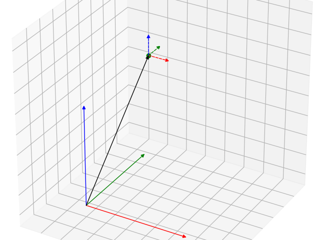

# SymMePlot
[](https://github.com/TJStienstra/symmeplot/actions?workflow=Tests)

SymMePlot is a visualization tool specifically designed for mechanical systems that are
created using the mechanics module in [SymPy], `sympy.physics.mechanics`.

The `sympy.physics.mechanics` module allows users to define mechanical systems in a
symbolic manner to derive their analytic equations of motion. During this process, users
can construct various objects such as reference frames, points, bodies, and more.

SymMePlot enhances this process by providing a way to visualize these constructed
objects. It integrates with visualization backends like [Matplotlib], and creates visual
representations based on the parametrization of the symbols involved in the system.

To install `symmeplot` with the `matplotlib` visualization run:

```bash
pip install git+https://github.com/TJStienstra/symmeplot.git matplotlib
```

## Usage
Most of your programs are expected to follow this structure:
1. Creation of the system in sympy using the objects from `sympy.physics.mechanics`.
2. Create a figure with a 3D axes with `matplotlib`.
3. Initiate a `Scene` with the inertial frame and absolute origin.
4. Add your frames, vectors and points to the plotter instance.
5. Lambdify and evaluate the system.
6. Plot the system.

Below is a basic example of how this looks in practise:
```python
import numpy as np
from symmeplot.matplotlib import Scene3D
from sympy.physics.mechanics import Point, ReferenceFrame, dynamicsymbols

# Create the system in sympy
N = ReferenceFrame("N")
A = ReferenceFrame("A")
q = dynamicsymbols("q")
A.orient_axis(N, N.z, q)
N0 = Point("N_0")
v = 0.2 * N.x + 0.2 * N.y + 0.7 * N.z
A0 = N0.locatenew("A_0", v)
# Create the instance of the scene specifying the inertial frame and origin
scene = Scene3D(N, N0, scale=0.5)
# Add the objects to the system
scene.add_vector(v)
scene.add_frame(A, A0, ls="--")
scene.add_point(A0, color="g")
# Evaluate the system.
scene.lambdify_system(q)
scene.evaluate_system(0.5)
# Plot the system
scene.plot()

# You can also animate this system.
ani = scene.animate(lambda q: (q,), frames=np.linspace(0, 2 * np.pi, 60))
ani.save("animation.gif", fps=30)
```



[Matplotlib]: https://matplotlib.org/
[SymPy]: https://www.sympy.org
